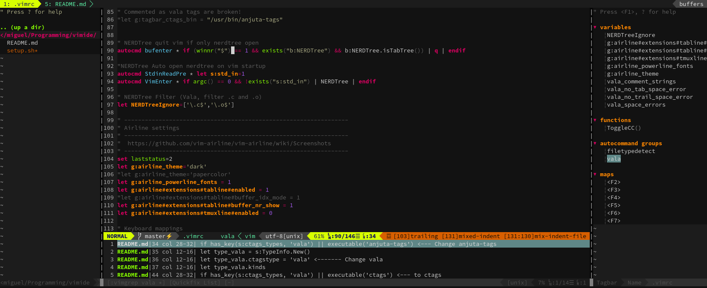

# VIMIDE
Shell script to prepare **Vim** and **Tmux** as a simple **IDE**'like code editor with focus on [Vala](http://wiki.gnome.org/Projects/Vala) language. 



## Description
- Using [Vundle](https://github.com/VundleVim/Vundle.vim) as Vim plugin manager.
- Focus on Vala language (adds syntax highlighting and support)
- anjuta-tags / ctags (Check workaround)
- Includes 2 additional colorschemes (valloric and github)
- Installs powerline fonts
- Installs tmux

## Shortcut maps and bindings

|Key|Application|Toggles|
|---|-----------|-------|
|<kbd>F2</kbd>| Vi/Vim | Nerdtree (Left side pane) |
|<kbd>F3</kbd>| Vi/Vim | Line 80 marker |
|<kbd>F4</kbd>| Vi/Vim | Tagbar (Right side pane) |
|<kbd>F5</kbd>| Vi/Vim | Indentation markers|
|<kbd>F6</kbd>| Vi/Vim | Space and Tab markers |
|<kbd>F7</kbd>| Vi/Vim | **Line numbers** |
|<kbd>F7</kbd>|  Tmux  | **previous Window** |
|<kbd>F8</kbd>|  Tmux  | next Window |
|<kbd>F9</kbd>|  Tmux  | new Window |
|<kbd>F11</kbd>|  Tmux  | tmux split with zsh (*Check*) - Conflict with gnome terminal Fullscreen F11|
|<kbd>F12</kbd>|  Tmux  | send-prefix (*nested*) |

## Tagbar workaround
It seems anjuta-tags isn't working so here is a workaround: 

- use **ctags** instead of **anjuta-tags**
- edit (as shown below):
   - `~/.vim/bundle/tagbar/autoload/tagbar/types/ctags.vim`
   - `~/.vim/bundle/tagbar/autoload/tagbar/types/uctags.vim`
   
From:

```vim
if has_key(s:ctags_types, 'vala') || executable('anjuta-tags') <--- Change anjuta-tags 
  let type_vala = s:TypeInfo.New()
  let type_vala.ctagstype = 'vala' <------- Change vala
  let type_vala.kinds    
  ...
```

To:

```vim
if has_key(s:ctags_types, 'vala') || executable('ctags') <--- to ctags
  let type_vala = s:TypeInfo.New()
  let type_vala.ctagstype = 'c#'   <------- To C#
  let type_vala.kinds    
  ...
```

This will force C# as the language used. Not the best solution but works to some extent.

It will also complain on Plugin updates as changes are local... 

## Setup
Run the shell script *`setup.sh`*.

## Powerline font

Set the terminal font to a powerline one. I've been using `Droid Sans Mono Dotted for Powerline Regular 11`
